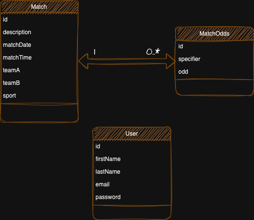

# MatchOdds Project (Stoiximan from now on) for Accepted

This document contains all the necessary information about the Stoiximan project for Accepted.

## Technologies

The technologies used in the project are the following:
- **Apache Maven**: a software project management and comprehension tool. 
Based on the concept of a project object model (POM), Maven can manage a project's build, 
reporting and documentation from a central piece of information.
- **Spring Boot**: Spring Boot Extension is Spring's convention-over-configuration solution intended 
to aid in creating production-grade Spring applications with minimal amounts of configuration.
- **PostgreSQL Database**: a free and open-source relational database management system emphasizing 
extensibility and SQL compliance.

## Project structure

- The root package for all source Java classes is `gr.accepted.stoiximan`.
  - The `controller` package contains the `controler` classes. Serves as a 
  web controller, handling HTTP requests and facilitating the interaction 
  between client and server by defining methods for specific URL mappings. 
  It plays a central role in processing user input and returning responses, 
  often in the form of views.
  - The `model` package contains the `Entity` and the `DTO` classes. An `Entity` 
  represents a JPA (Java Persistence API) entity, mapping to a database table. 
  It defines the structure and properties of objects that are persisted in the database.
  A `DTO` (Data Transfer Object) class is a plain Java class used for transferring 
  data between different layers of an application, often between controllers and 
  services, to encapsulate and transfer specific sets of data without exposing 
  the underlying domain model.
  - The `repository` package contains `Repository` classes. A `Repository` serves 
  as a Spring Data repository, facilitating database operations. It is used to 
  interact with a data source, providing a mechanism for CRUD (Create, Read, 
  Update, Delete) operations on entities.
  - The `security` package contains Spring Boot's security classes enabling 
  and handling Spring Security.
  - The `service` package contains the `Service` classes. A `Service` represents 
  a service component, encapsulating business logic and facilitating the separation 
  of concerns in a Spring application. It is often used to centralize and manage 
  application-specific functionality.
  - The `rescources` folder contains the following files:
    - `application.properties`: Spring Boot configurations.
    - `banner.txt`: The banner displayed in the logs on startup.
    - `data.sql`: The sql script to prepopulate the DB on startup.
- All sample jUnit tests are contained under `src/test/java`. 
Sample total coverage is 100% classes and 80% lines covered.

## Stoiximan Domain Model



## Stoiximan Features

All project requirements have been implemented and more specifically:

- The project is a REST Web API that requires user registration.
- Users are able to signup using the appropriate endpoints under `/api/v1/users`.
- CRUD operations have been implemented for all entities (`User`, `Match` and `MatchOdds`).
- The CRUD operations are:
  - findAll()
  - findById(...)
  - createEntity(...)
  - updateById(...)
  - deleteById(...)
- Each `User` contains the following information:
  - ID
  - First name
  - Last name
  - Email
  - Password
- Each `Match` contains the following information:
  - ID
  - Description
  - Match Date
  - Match Time
  - Team A
  - Team B
  - Sport, one of Tennis, Football or Basketball
  - List of Match Odds
- Each `MatchOdds` contains the following information:
  - ID
  - Specifier
  - Odd
  - Match reference
- A postman collection is available in the `Postman` folder.

## Pre-populated Matches, Match Odds and Users
Upon execution the PostgreSQL DB is populated with sample data.
These data are contained in data.sql file in resources folder.
5 Users are generated:
- Nikos Giannopoulos, username/email: '**nikos@gmail.com**', password: '**password**',
- George Panagiotidis, username/email: '**george@gmail.com**', password:  '**password**',
- John Papadopoulos, username/email: '**john@gmail.com**', password:  '**password**',
- Mary Mousteraki, username/email: '**mary@gmail.com**' password: , '**password**',
- Helen Giannopoulou, username/email: '**helen@gmail.com**', password:  '**password**'

You may use any of these credentials to test the Postman collection without creating a new user.

## Import the project to an IDE

You can import the project to your IDE of choice as you would with any Maven project. 
We used `IntelliJ IDEA Community edition`.

## Running the application without Docker

Assuming you already have an <u>active PostgreSQL instance up and running</u>, in order to run 
the project locally, the `application.properties` file must contain the following lines:

```
spring.datasource.url=jdbc:postgresql://localhost:5432/postgres
spring.datasource.username=postgres
spring.datasource.password=postgres

spring.jpa.hibernate.ddl-auto=create-drop
spring.jpa.properties.hibernate.dialect=org.hibernate.dialect.PostgreSQLDialect
spring.sql.init.mode=always
spring.jpa.defer-datasource-initialization=true

spring.security.user.name=admin
spring.security.user.password=password
```

The project is a standard Maven project. To run it from the command line, type `mvn spring-boot:run`.

## Running the application with Docker

The project is also dockerized. 

In order to run the project locally, the `application.properties` file must contain the following lines:

```
spring.datasource.url=${DATABASE_URL}
spring.datasource.username=${DATABASE_USERNAME}
spring.datasource.password=${DATABASE_PASSWORD}

spring.jpa.hibernate.ddl-auto=create-drop
spring.jpa.properties.hibernate.dialect=org.hibernate.dialect.PostgreSQLDialect
spring.sql.init.mode=always
spring.jpa.defer-datasource-initialization=true

spring.security.user.name=admin
spring.security.user.password=password
```

You can deploy it by typing the following in the command line:
- `mvn clean package -Dmaven.test.skip=true`: creates the JAR containing the application.
- `docker compose up -d`: deploy the application to docker.

## Testing the Application

A Postman collection has been provided inside the `postman` folder containing 
sample requests for all endpoints.